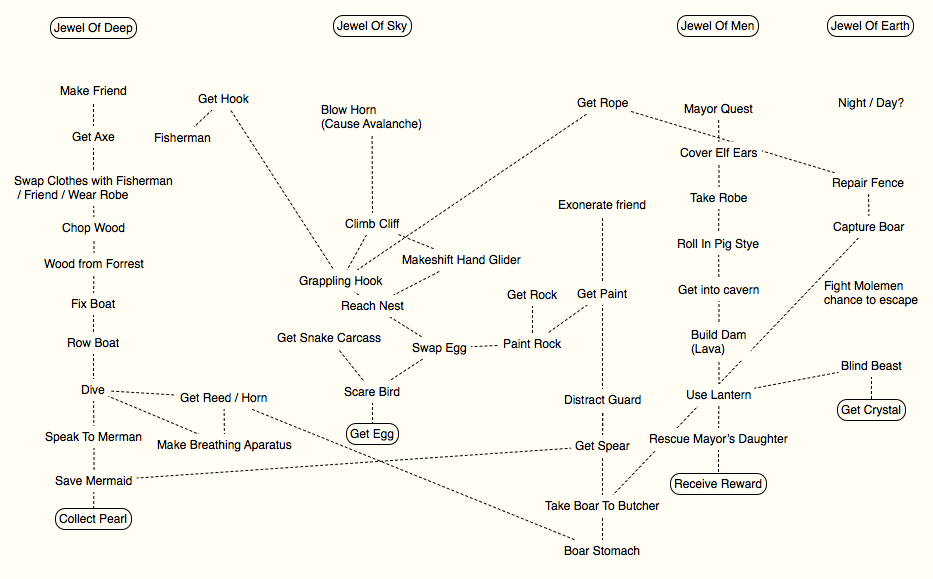

# Sylvania

An Interactive Fiction Game

(From my teen imagination)

## Plot

You are a tree elf, heir to the kingdom. Your father has died unexpectedly and you have been blamed for it! However, you suspect your uncle has framed you for your father’s murder. A shaman saves you in the only way he can ­ trial by ordeal.

To prove your innocence you are given a trial by ordeal ­ the impossible task of uniting the four
essential elements together. You must collect 4 jewels from ­ mountains, caverns, village, and sea.

## Characters

* Evil Uncle
* Shaman (forest)
* Fisherman (on seashore)
* Imprisoned sacrifice (in caves)
* Friendly townsman
* Hunter / Trapper (in mountains)

## Map

## Puzzles

### Jewels

* Jewel of the sky - great eagle's nest
* Jewel of the earth - molemen protect
* Jewel of the deep - mermen guard
* Jewel of the spirit? - in castle?

#### To get Jewel of the Deep

* Go to fisherman - He tells you about jewel of sea
* Can't take you to spot without boat fixed
* Have to get wood from forest
* But guards will stop you going in
* Get axe from ? - maybe have to buy, and to earn money you must ...
* To distract guards need to get someone to dress as you
* (can be fisherman - may be man in village - if do him favor - need younger man who can outrun guards - maybe old man will try but fail))

* So, If you change clothes with fisherman (& suggest he lead guards away)
* Then can chop wood and bring it back to boat and fix it
* He takes you to spot but you can't dive long enough because you don't have bladder (reed will let you breath for a while - maybe long enough to find out why) 
* To get bladder ... have to get wild boar from Butcher - gross? (but molemen have taken local boars?) 
* To get boars from molemen ... (Perhaps in only above ground part / fenced in / break out without being attacked / camoflage)

* When have boar take to butcher and get bladder
* Take bladder to fisherman who turns it into breathing apparatus
* Visit mermen who tell you you can have jewel if you rescue mermaid (mermaid is being held by octopus) 
* Get spear ... (Maybe get from guard who drops it - or guard at castle, or suit of armor) 
* Spear between eyes (Capture ink for some reason?) 
* Collect pearl - you have the first jewel!

Qs -

* Where and how to get Axe?
* Alt. to Boar bladder?

#### To get Jewel of Sky

* Have to reach nest - maybe need to make grappling hook / attach to rope (get iron from anchor or elsewhere to blacksmith - have to do him favour or get coins)
* Have to swap out something egg shaped in nest
* Must find right thing
* But then have to color it - where to find or make paint
* And get bird away long enough to swap it out - how to scare away?
* (If get bird away but don't swap will come after you and take egg back - after killing you) * Distract with something shinny - make shell ornament? collect enough

Qs -

* Where to get elements for grappling hook?
* Where and how to get egg shaped object?
* Where to find or make paint?
* How to scare away bird? Snake skin / carcass?
* Or distract it - where and what shiny object? Maybe need to ensure doesn't come back?

#### To get Jewel of the Earth

* Have to infiltrate mole men - disguise self as one
* Steal robe? Colour it? Make musty (or they will smell you out)
* Also rescue woman they are trying to marry off to leader (girlfriend of friend in village, or daughter of mayor maybe - that way can be rewarded)
* Other dangers - fire / lava - maybe divert underground stream
* Maybe have to find / make alternative route out (because entrance blocked)
* Could use sounds to disorient them - what with?

Qs -

* Where to get robe from? Monk?
* How to divert stream? Block it up, but how?
* How to make way out / or distract mole men?
* Note: Account for arriving without knowing about girl's story

#### To get Jewel of the Spirit

* First challenge is finding out what this is
* Normal human friend can help (cover elf ears, introduce you to others)
* But maybe he has fallen from grace too, or not in position to help unless you help him first
* Perhaps he was one tending pigs when they were stolen - maybe he was set up / distracted
* Have to prove purity of heart?
* (Could do this by rescuing mayor's daughter from mole men)

Qs -

* How do you discover what this jewel is? Reward?
* Sub-story about friend? Helping them?
* Note: this section needs most work

